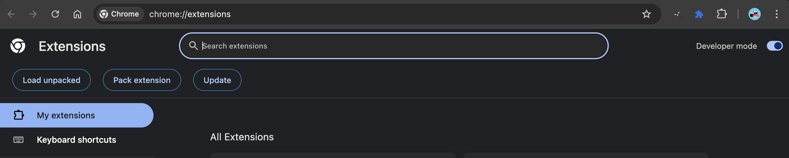

---

<!-- Table of Contents -->
- [The Problem](#the-problem)
- [Features](#features)
- [How It Works](#how-it-works)
  - [Manifest JSON – The Blueprint 🗂️](#manifest-json--the-blueprint-)
  - [Popup Interface – The Frontend 🎨](#popup-interface--the-frontend-)
  - [Data Extraction Logic – The Backbone 🧠](#data-extraction-logic--the-backbone-)
  - [Content Script – Page Button 🖱️](#content-script--page-button-)
  - [API Calls – The Glue 🌐](#api-calls--the-glue-)
- [Why I Built It](#why-i-built-it)
- [Lessons Learned](#lessons-learned)
- [Get EvalExtractor](#get-evalextractor)
- [Let's Set it Up](#set-it-up)
- [Final Thoughts](#final-thoughts)

---

## The Problem

Let’s face it, manually handling Genesys evaluations can be tedious. Here’s the usual process:
1. Navigate to the Genesys interaction page.
2. Copy-paste evaluation data.
3. Attempt to align it in a document or spreadsheet.
4. Cry when it doesn’t format correctly.

I decided this chaos needed some order, and that’s where EvalExtractor was born. now there is an Aha. idea ....

Check out a Raw Evaluation

---

## Features

- Automatically extracts **Evaluation ID** and **Conversation ID** from the page URL.
- Fetches detailed evaluation data using Genesys’s API.
- Converts all data into a neat, readable PDF using [jsPDF](https://github.com/parall.ax/jsPDF).
- Works seamlessly in Chrome (and probably on the edge of Edge).

---

## How It Works

Here’s the nerdy bit. EvalExtractor is built on the following components:

### Manifest JSON – The Blueprint 🗂️

Every Chrome extension begins with the `manifest.json` file. It serves as the configuration blueprint, defining the extension's identity, permissions, and behavior. This file is essential for informing Chrome about the extension's purpose, capabilities, and resource requirements, ensuring seamless integration with the browser.

```json
{
  "manifest_version": 3,
  "name": "EvalExtractor",
  "version": "1.0",
  "description": "Extracts evaluationId and conversationId from the current tab's URL.",
  "permissions": ["activeTab", "tabs", "storage"],
  "host_permissions": [
    "https://*.mypurecloud.com/*",
    "https://api.mypurecloud.com/*"
  ],
  "action": {
    "default_popup": "popup.html",
    "default_icon": "icon.png"
  }
}
```
Mainfest JSON in Visual Code


EvalExtractor doing what it does best, preparing to Extract that Evaluation


Sample PDF Generated from Evaluation

---

### Popup Interface – The Frontend 🎨

The user interface is minimal yet functional, designed for simplicity and ease of use. The popup window loads quickly and displays interaction details, such as the `evaluationId` and `conversationId`, so that you can verify you are looking at the correct evaluation. Additionally, it includes a clearly labeled button that allows users to generate a PDF report of the interaction. The interface is optimized to ensure a seamless user experience, with intuitive navigation and responsive elements that work across various screen sizes and browser environments.

```html
<h1>EvalExtractor</h1>
<h2>Interaction Details</h2>
<div class="info">
  <strong>Evaluation ID:</strong> <span id="evaluationId">N/A</span>
</div>
<div class="info">
  <strong>Conversation ID:</strong> <span id="conversationId">N/A</span>
</div>
<button id="myButton">Generate PDF</button>
```
EvalExtractor and all its Glory


---

### Data Extraction Logic – The Backbone 🧠

In `popup.js`, the script begins by extracting the evaluationId and conversationId from the current tab’s URL using a regular expression (regex) to parse and validate the required parameters efficiently. Once the IDs are obtained, the script initiates an API call to Genesys’s platform using the fetch method to retrieve detailed evaluation data. This process involves constructing a secure HTTP request, including necessary headers such as authentication tokens, to ensure successful communication and validation with the Genesys API.

After fetching the evaluation details, the data is processed and formatted into a structured layout using jsPDF, a (MIT licensed) JavaScript library for generating PDF documents directly in the browser. The script dynamically creates a professional-looking PDF containing relevant evaluation details, such as scores, agent performance metrics, and comments, making it ready for download or sharing. Error handling mechanisms are also implemented to address scenarios like missing data, invalid API responses, or network issues, ensuring robustness and reliability.

```javascript
const ids = extractIdsFromUrl(currentTabUrl);
const accessToken = await getAuthToken();
const evaluationData = await fetchEvaluationData(ids.conversationId, ids.evaluationId, accessToken);

const { jsPDF } = window.jspdf;
const doc = new jsPDF();
doc.text(`Evaluation ID: ${ids.evaluationId}`, 10, 10);
doc.save('evaluation-details.pdf');
```

---

### Content Script – Page Button 🖱️

The extension injects a floating button into the Genesys page, offering quick access for users.

```javascript
function addButton() {
  const button = document.createElement('button');
  button.innerText = 'Export Evaluation';
  button.addEventListener('click', () => alert('Button clicked!'));
  document.body.appendChild(button);
}
addButton();
```

---

### API Calls – The Glue 🌐

Using the Genesys OAuth token (stored securely in `config.json`), the extension queries the Genesys API for evaluation data.

```javascript
const tokenUrl = `https://login.${ENV}/oauth/token`;
const response = await fetch(tokenUrl, {
  method: 'POST',
  body: params,
});
return response.json().access_token;
```

---

## Why I Built It

Aside from the fact that repetitive tasks make me grumpy, I wanted to explore how Chrome extensions could streamline workplace tools and eliminate inefficiencies. I’ve always been intrigued by how small, purposeful automation can save time and reduce errors in day-to-day tasks. Creating a Chrome extension felt like the perfect way to combine my curiosity about improving workflows with my passion for problem-solving.

Additionally, I love tinkering with APIs, exploring their potential to fetch, transform, and display data in meaningful ways. There's something fascinating about turning raw, complex data into user-friendly tools that can genuinely enhance productivity. Building this extension not only scratches my itch for learning and experimentation but also feels rewarding when I see it making an actual difference in simplifying tasks for others.

My Lightbulb Moment


---

## Lessons Learned

- **Security First**: OAuth tokens must be handled with care, and treated with the love and respect they Deserve.
- **jsPDF is a Beast**: Seriously, this library does everything short of making coffee.
- **Iterate and Improve**: Users love simple interfaces, so keep it clean and functional.

---

## Get EvalExtractor

Ready to simplify your Genesys evaluations? Download the extension from [GitHub](#). Feedback and feature suggestions are always welcome!

Let’s stop wasting time on tedious tasks and start automating like pros.

---

## 🎉 Setup Guide: From Zero to Hero in No Time! 🚀

Setting up your extension is *ridiculously* simple. Even if you’ve never set anything up in your life, I promise you can do this. Let’s dive in:

Your first task is to **tame the mighty `config.json` file**. This file is the brain of the operation, and it needs some credentials to work its magic.  

What you need to do:  
- Create an **OAuth client** in Genesys.  
- Copy the details into your `config.json` file like it’s the Holy Grail.  

Need a little help? No problem. Check out this **life-changing link**: [Create an OAuth Client](https://help.mypurecloud.com/articles/create-an-oauth-client/).  

Genesys has many environments, and it’s super important to pick the right one. Otherwise, your extension will sit there doing absolutely nothing.  

If you’re in the **US East** region, use `mypurecloud.com`. Not sure what environment to use? This link has you covered: [Genesys Cloud Platform APIs](https://developer.genesys.cloud/platform/api/).  

Here’s what your `config.json` file might look like:  

  

Now for the fun part: actually loading your extension. Time to flex your *Chrome skills*!  

1. Open Chrome. 
2. Type `chrome://extensions` in the URL bar like a pro.  
3. **Enable Developer Mode**. (It’s in the upper-right corner. Yes, click it. You’re a developer now, congratulations!)  
4. Click **Load Unpacked**.  
5. Select the folder containing your extension files. BOOM. Magic happens.  

Here’s what the screen looks like:  
  

If everything went smoothly (and why wouldn’t it?), your shiny new extension should now appear in Chrome, ready to make your life easier. If it didn’t work... well, maybe double-check your steps. Or grab a coffee. Or cry. It’s all part of the developer experience.  

---
## Final Thoughts

Building EvalExtractor was both fun and challenging. If you’re considering building a Chrome extension, my advice is: *do it*. You might end up solving a problem you didn’t even know existed—and maybe have some fun along the way.

Happy extracting!


