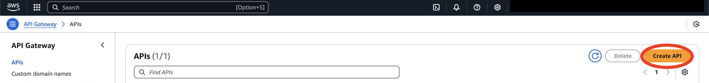

Hello everyone! I hope everyone had a good first month of 2025. In this blog, I would like to share how you would configure an Amazon API Gateway to invoke Genesys Cloud APIs.


## Why use an API Gateway?

An API Gateway is a software component that acts as a single entry point for all API requests. It sits between clients and backend services, receiving requests, routing them to the appropriate service, and aggregating the responses to send back to the client. It acts as a "middleman" to manage API access and streamline communication between applications and various backend services, like the Genesys Cloud API, that often includes features like authentication, rate limiting, and monitoring.

Rather than calling directly to Genesys Cloud APIs, here are some benefits in using an API Gateway:

1. **Centralized Control**: Since an API Gateway already acts as a single entry point for all of your clients that access your suite of resources, it simplifies management and allows for consistent security policies across all applications. It abstracts the complexity of interacting with various backend systems, making it easier for developers to build and maintain integrations. You can also monitor API usage patterns to identify performance issues, and apply cost optimization over your system.

2. **Enhanced Security**: You can implement robust authentication and authorization processes at the gateway level, transform or mask sensitive data within requests and/or responses before reaching your backend services, control the rate of requests, and apply cybersecurity implementations like DDoS Protection.

3. **Improved Performance**: You can cache frequently accessed data across your backend services, reducing latency and improving response times for your clients. You can also utilize load balancing to distribute traffic across multiple instances of your backend service, ensuring high availability and scalability.

With Amazon API Gateway, you will be able to configure these things.

## Requirements

1. An **AWS Account** with Amazon API Gateway permissions.
2. A **Genesys Account** with the necessary permissions for your use case.
3. A **basic understanding** of both Amazon API Gateway and Genesys Cloud API.

## Configuring the Amazon API Gateway

To start, there are several ways to set up and configure the Amazon API Gateway. But in this case, I'll show you how to do it in AWS Management Console.

There are three types of configuration depending on your needs:

1. [HTTP API](#1-http-api "Go to the HTTP API section")
2. [REST API: Proxy Integration](#2-rest-api-proxy-integration "Go to the REST API Proxy Integration section")
3. [REST API: Non-Proxy Integration](#3-rest-api-non-proxy-integration "Go to the REST API Non-Proxy Integration section")

## 1. HTTP API

The HTTP API configuration is straightforward as it forwards the entire request directly to the Genesys Cloud API. It is best used when your use case is simple where you don't need to modify the information before or after sending any information to the client and the backend services. It also has simple features that you can setup like route authorization, CORS configuration, metrics, logging, throttling, OpenAPI Definition Import and Export. Being simple as it is, it has cheaper cost compared to REST API. This is how you set it up:

1. Go to **API Gateway** > **Create API** > On HTTP API: **Build**.



2. Add an HTTP integration. Select which **Method** you want the API Gateway to use and enter the **URL Endpoint**. If you want to expose the API Gateway to access all of Genesys API endpoints, add a `/{proxy}` at the end and use `ANY` on the method. For this demonstration, I used the domain `api.mypurecloud.com`. _Change this to the domain that matches the region of your Genesys Cloud organization or if you have a custom domain for your Genesys organization. For example, `api.usw2.pure.cloud` is used for the US West (Oregon) region._ Also, provide a name for your API.


3. Configure the route that will point to the integration that you created. In this step, you have to provide the route that will direct to the integration endpoint you have provided by declaring which **Method** to expose and the **Resource path**. Given our configuration in the previous step, we will use the method `ANY` and put `{proxy+}` to the Resource path. Note that the `{proxy+}` will be substituted to the `{proxy}` in the integration we created.


4. _(Optional)_ Define stages that you need. You can add multiple stages depending on your needs. In a typical development, you want at least 3 (development, staging, and production). You can also set a specific stage if you want your changes to auto-deploy or not. Note that with stages, you have to input the specific stage as the first path then your specific route to access the intended stage. We can leave the `$default` stage for our demonstration.

5. Review the details and then **Create**.

:::primary
**Note:** You may also configure the API Gateway to expose only one path of Genesys' API like `/users`, `/groups`, etc. Just ensure that the integration and the routes are properly configured. For example, you only want to expose the `/users` path, what you need to put in the URL endpoint is `https://api.mypurecloud.com/api/v2/users/{proxy}`. You might also want to modify the route pointed to this integration. Always remember that the `{proxy+}` in a given **route** will be substituted to the `{proxy}` of the assigned **integration**.
:::

## 2. REST API: Proxy Integration

The REST API offers more features compared to the HTTP API, such as the use of API keys, the ability to use certificates for backend authentication, and caching. However, it is slightly more costly than the HTTP API. Nevertheless, you can still set it up like HTTP API with REST API Proxy Integration. Here are the steps on how to do it:

1. On the **Create API** section, choose the **REST API** and then **Build**.


2. Choose **New API**. Name your API. You can also add description if you want. Then, choose your endpoint type relevant to your use case. For this demonstration, we'll just use a `Regional` endpoint type. Once you provided the details, click **Create API**.


3. Create a resource. In the main navigation pane, click **Resources**. Choose **Create resource**. Then on the **Create resource** page, Turn on **Proxy resource**. Keep Resource path as `/`. Input `{proxy+}` on the Resource name and keep CORS (Cross Origin Resource Sharing) turned off. Once filled up, choose **Create resource**.


4. Integrate the `/{proxy+}` resource with the Genesys API by going to the `ANY` under the `/{proxy+}` resource. Under the warning symbol, choose **Edit integration**. You cannot deploy an API that has a method without an integration.


5. Choose **HTTP** Integration Type. Turn on the **HTTP proxy integration**. For **HTTP Method**, select `ANY`, Enter in the **Endpoint URL** the URL of Genesys API with the `/{proxy}` at the end. In this demonstration, we put `https://api.mypurecloud.com/{proxy}`. _Again, change this to the domain that matches the region of your Genesys Cloud organization or if you have a custom domain for your Genesys organization. For example, `api.usw2.pure.cloud` is used for the US West (Oregon) region._ Then, click **Save**.


6. Test the API in the console. You can make a test call to your method to see if the API Gateway calls the Genesys API properly and returns a proper response. It skips authorization and directly invokes your method. You can do this on the **Test** tab on a given resource method. Once there, you can make a test call. For an example, we make a test call of `GET /api/v2/users`.

If everything is configured correctly, the console will show the response from the Genesys API.


7. Deploy your API. Click **Deploy API** on the upper right side. Choose or create a stage on where will it be deployed, similar to what we did in HTTP API. In this demonstration, we created a `test` stage. Then **Deploy**.


You now have an API Gateway that invokes Genesys API using REST API. You can see the **Invoke URL** on your created stage in the **Stages** section in the navigation page.


## 3. REST API: Non-Proxy Integration

Non-Proxy integration is more complex and is suitable when you need greater control over the information being passed between the client and services. It is suitable for cases when you need a finer control in data validation and transformation. With REST API, you can configure settings for each resource and can have both proxy and non-proxy integrations in a single API. I'll show you how to do it:

1. Using the REST API we created earlier with Proxy Integration, create another **Resource**, but this time, of course, we create a non-proxy one. For this demonstration, let's create a `/users` resource that we can customize to call the `GET /api/v2/users` endpoint of Genesys API.


2. Create a method for the `/users` resource. For our case, we'll make a `GET` method. Choose the `HTTP` **Integration type**. Select `GET` on the HTTP Method and enter the **Endpoint URL**. For our case, we'll enter `https://api.mypurecloud.com/api/v2/users`. We can keep the rest of the **Method details** untouched.


3. _(Optional)_ Setup the **Method request settings**. Here you can configure if you want authorization, request validation, or API key requirement when calling the `GET /users` resource. You can even make an Operation name for the method. For now, we'll leave everything as is.


4. Define your **URL query string parameters**, **HTTP request headers**, and **Request body**. Depending on your use case, you might want to get information via query string parameters, HTTP request headers, or request body that needs to be passed through or that needs to be processed before we pass it to the API. In here, for query string parameters and HTTP request headers, you define what can or needs to be inputted when calling the endpoint by ticking the required check box or if it will be cached and, for the Request body, you can define the **Content type** and the **Model** expected in the body. For our demonstration, let's define the some query parameters that we'll need when getting the list of users like `pageSize` and `pageNumber`. Let's also define that the client must provide an `Authorization` header that contains the access token to Genesys API when calling this endpoint. We'll leave the request body as is. Once done, click **Create Method**.


5. Configure your **Integration request settings**. In this part, you'll configure what will be passed when we call the `GET /api/v2/users` endpoint. You will see on the method details the things you have provided earlier, which you can also edit. The important things you need to provide, depending on your use case, are the URL path parameters, URL query string parameters, URL request headers parameters, and mapping templates. For the parameters, you provide what will be included when calling the endpoint. You have to provide the name and the value. You can set a fixed value or get the value by mapping it from the method request settings that you defined earlier. For the mapping templates, you will need it when you need to do transformations on your request body. For our case, we'll passthrough the `pageNumber` query string parameter and the `Authorization` header. To show that we can also set a fixed value, let's set string parameter of `pageSize` to `'5'`. Once everything is set up, click **Save**.


6. _(Optional)_ Configure your **Integration response settings**. This is where you setup on how to handle the response after calling the API. This is important to setup if you want to properly handle errors received from the API. For our case, we'll leave it as is and passthrough the response from the API.

7. _(Optional)_ Configure your **Method response settings**. This is where you setup how would you form the response back to the client on a given status code. You can setup the headers and the response body. We'll also keep it as is for our demonstration.

8. Test your method internally on the **Test** tab. Enter the query strings and headers you want to input and also if you also need a client certificate to test. For our case, let's put in the query string the `pageNumber` to `2` and also the access token in the `Authorization` header. It is expected that when we call this method, we'll have a list of 5 users since we set a fixed number of `pageSize` to 5.

We can see in the response from the result that it returned the list of users with a size of 5 in page number 2.


9. Deploy your API and test it externally.

:::primary
**Important Note:** While this blog didn't cover it in detail, it is important for you to utilize the security features of the API Gateway, such as authorization mechanisms, validating incoming requests, and creating resource policies, to prevent unauthorized access. You can learn more in this [article](https://docs.aws.amazon.com/apigateway/latest/developerguide/security.html).
:::

## Testing

You can now use your created API Gateway to call the Genesys API. You can see it in your API list and looking through the details, you will see the assigned domain URL with the usual format of `https://XXXXXXXX.execute-api.{aws-region}.amazonaws.com`. If you want to use a specific stage, the URL should look like `https://XXXXXXXX.execute-api.{aws-region}.amazonaws.com/{stage-name}` Test it using [Postman](https://www.postman.com/downloads/ "Goes to the Postman download page"), cURL, or any other popular API client that you use. _Take note that you still need to provide the access token when calling the API via API Gateway._

### Testing with Postman

I'll show you how to test with Postman by calling `GET api/v2/users`.

1. Open Postman and create a new **HTTP Request**.


2. Set the method to `GET` and enter the URL.


3. Set your authorization method. If you will use an access token, choose `Bearer Token` and input your token. If you will use client credentials, use the `OAuth 2.0` and configure the token request by providing the Client ID, Client Secret, and the Access Token URL. _For this demonstration, I'll be using the `https://login.mypurecloud.com/oauth/token` as the Access Token URL._ Click **Get New Access Token** and if successful, click **Use Token**.


:::primary
**Note:** Postman recommends to put your sensitive details like access token, client id, and client secret in an Environment.
:::

4. Input your query params, headers, and/or body (if applicable). For our case, let's add a `pageSize` in the query params and set it to `5`.


5. Press **Enter** or click **Send**.

If everything is inputted correctly, you will see the response from the Genesys API.


For more information on how to use Postman, you can explore [Postman Docs](https://learning.postman.com/).

### Testing with cURL

Open your computer's terminal and enter the command with a format like this:

```bash
curl -X POST \
  'https://XXXXXXXX.execute-api.{aws-region}.amazonaws.com/path' \
  -H 'Content-Type: application/json' \
  -H 'Authorization: Bearer {your_access_token}' \
  -d '{
        "name": "New Resource",
        "value": 123
      }'
```

where the following options:

- `-X` - determines the method to be performed
- `-H` - header
- `-d` - body / data

To learn more other options, enter the command `curl --help` or [go to this tutorial](https://curl.se/docs/tutorial.html).

If your API Gateway is set to send requests in proxy to the Genesys Cloud API and would want to call `GET api/v2/users`, your cURL command will look something like this:

```bash
curl -X GET \
  'https://XXXXXXXX.execute-api.{aws-region}.amazonaws.com/api/v2/users' \
  -H 'Authorization: Bearer {your_access_token}' \
  -H 'Content-Type: application/json'
```

:::primary
**Note:** You may also want to see what the API Gateway receives on its end by enabling logging and monitoring. More information can be seen [here](https://docs.aws.amazon.com/apigateway/latest/developerguide/security-monitoring.html).
:::

## Invoking APIs through the Amazon API Gateway using Genesys Cloud CLI/CX as Code/SDKs via Gateway Configuration

Once you have properly set up your API Gateway, it is easy to configure Genesys Cloud CLI, CX as Code, and Platform SDKs to route through the API Gateway for Genesys APIs.

:::primary
**Note:** For developers who used the non-proxy integration with a transformation of request and/or response to and/or from Genesys Cloud API, please ensure that your API Gateway will have the same request and response structure based on the Genesys Cloud API Documentation. It might cause errors when communicating with the API and the CLI, CX as Code, or SDKs. It is encouraged to use the [HTTP API](#1-http-api "Goes to the HTTP API section") or [Proxy Integration](#2-rest-api-proxy-integration "Goes to the REST API Proxy Integration section") when accessing the API Gateway via the CLI, CX as Code or SDKs.
:::

In general, you will need the following parameters:

1. **Host Name** - The address of your gateway. eg. `XXXXXXXX.execute-api.{aws-region}.amazonaws.com` or `XXXXXXXX.execute-api.{aws-region}.amazonaws.com/{stage}` if you want to call a specific stage.
2. **Port Number** - eg. `443` _(The default for HTTPS)_, `80` _(The default for HTTP)_, etc.
3. **Protocol** - eg. `HTTP` or `HTTPS`
4. **Username** - _(Optional)_ You have to provide this if you setup the gateway to have authentication
5. **Password** - _(Optional)_ You have to provide this if you setup the gateway to have authentication
6. **Gateway Path Parameters** - _(Optional)_ The path in the gateway that points to either the login URL of Genesys (login path) or the API URL (api path). **NOTE: You have to provide the login path if you are authenticating via Authorization Grants.**

:::primary
**Reminder:** Ensure that you have added a login path _(Resource path for REST API and Route for HTTP API)_ in your API Gateway that you need to specify in the Gateway Config for your authentication if you are not setting an access token for a specific profile. The CLI, CX as Code, and SDKs call the API Gateway domain endpoint _(if you have enabled the gateway configuration)_ to generate an access token given your credentials that should be pointed to the Genesys login endpoint. For more details on how Genesys implements authorization, see [Genesys Cloud API Client Authorization](/authorization/platform-auth/).
:::

### Genesys Cloud CLI

With [Genesys Cloud CLI](/devapps/cli/ "Goes to the Genesys Cloud CLI Page in Developer Center") v110.1.0 or greater, it now supports gateway configuration. You can set this during `gc profiles new` command and provide details. These details will also include setting up the gateway configuration. If everything is provided correctly, you should have a file created in your home directory called `.gc/config.toml` that contains the gateway config information along with all the other configuration information.

You should see the following in your `.gc/config.toml`:

```toml
gateway_host = 'XXXXXXXX.execute-api.{aws-region}.amazonaws.com'
gateway_port = '443'
gateway_protocol = 'https'
gateway_username = 'john_doe1'
gateway_password = 'password'
gateway_pathparams = '{login: /loginpath, api: /apipath}'
```

You can also setup the proxy configuration using the `gc gateway` command. Provide the gateway details in a JSON file (we can name it `gateway.json`) like this:

```json
{ 
    "host": "XXXXXXXX.execute-api.{aws-region}.amazonaws.com",
    "port": "443",
    "protocol": "https",
    "userName": "john_doe1",
    "password": "password",
    "pathParams": {
        "login": "/loginpath",
        "api": "/apipath"
    }
}
```

You can then run the command `gc gateway --file=gateway.json` to enable it. If you want to disable the proxy configuration, you can run `gc gateway disable`.

### CX as Code

With [CX as Code](/devapps/cx-as-code/ "Goes to the CX as Code Page in Developer Center") v1.53.0 or greater, you can enable gateway configuration while setting up the Terraform provider so that underlying GO SDK uses this setting for making the API calls for creating the Genesys Cloud configuration objects.

A sample of the configuration looks like this:

```hcl
provider "genesyscloud" {
  oauthclient_id = "client-id"
  oauthclient_secret = "client-secret"
  aws_region = "aws-region"

  gateway {
    host     = "XXXXXXXX.execute-api.{aws-region}.amazonaws.com"
    port     = "443"
    protocol = "https"

    auth {
      username = "john_doe1"
      password = "password"
    }

    path_params {
      path_name  = "login"
      path_value = "/loginpath"
    }

    path_params {
      path_name  = "api"
      path_value = "/apipath"
    }
  }
}
```

You may also set the following environment variables to avoid hardcoding the Proxy and Auth Client information into your Terraform files:

```plaintext
GENESYSCLOUD_GATEWAY_PORT
GENESYSCLOUD_GATEWAY_HOST
GENESYSCLOUD_GATEWAY_PROTOCOL
GENESYSCLOUD_GATEWAY_AUTH_USERNAME
GENESYSCLOUD_GATEWAY_AUTH_PASSWORD
GENESYSCLOUD_GATEWAY_PATH_NAME
GENESYSCLOUD_GATEWAY_PATH_VALUE
```

### SDKs

You can also point the Genesys Platform SDKs to call the API Gateway instead. I'll be showing how to do it in the **Javascript SDK**.

There are two ways for you to configure it: [**via Configuration File**](#via-configuration-file) or [**via Inline Code**](#via-inline-code).

#### via Configuration File

You can add this in your INI file or JSON file.

INI:

```ini
[gateway]
host = XXXXXXXX.execute-api.{aws-region}.amazonaws.com
protocol = https
port = 443
path_params_login = loginpath
path_params_api = apipath
username = john_doe1
password = password
```

JSON:

```json
"gateway": {
  "host": "XXXXXXXX.execute-api.{aws-region}.amazonaws.com",
  "protocol": "https",
  "port": 443,
  "path_params_login": "loginpath",
  "path_params_api": "apipath",
  "username": "john_doe1",
  "password": "password"
}
```

#### via Inline Code

You just have to get an `ApiClient` instance where there is a function `setGateway()`.

```javascript
const client = platformClient.ApiClient.instance;

client.setGateway({
  host: 'XXXXXXXX.execute-api.{aws-region}.amazonaws.com',
  protocol: 'https',
  port: 443,
  path_params_login: 'loginpath',
  path_params_api: 'apipath',
  username: "john_doe1",
  password: "password"
});
```

If necessary, you can later remove the Gateway Configuration and fallback to the Environment setting using: `client.setGateway()`.

:::primary
**Note:** If you want to check how the SDK calls the API Gateway for debugging, you may enable logging. Details on how to do it are in [this blog](https://developer.genesys.cloud/blog/2021-05-06-sdk-config-and-logging/ "Goes to the Genesys Cloud SDK Configuration and Logging blog"). You may also want to see what the API Gateway receives on its end by enabling logging and monitoring. More information can be seen [here](https://docs.aws.amazon.com/apigateway/latest/developerguide/security-monitoring.html).
:::

To sum it all up, configuring an Amazon API Gateway with Genesys Cloud API is very easy and quick for you to have enhanced security, performance, and manageability of your integrations with Genesys Cloud.

## Additional resources

1. [Amazon API Gateway: Choose between REST APIs and HTTP APIs](https://docs.aws.amazon.com/apigateway/latest/developerguide/http-api-vs-rest.html)
2. [Amazon API Gateway: Create a REST API with an HTTP proxy integration](https://docs.aws.amazon.com/apigateway/latest/developerguide/api-gateway-create-api-as-simple-proxy-for-http.html)
3. [Amazon API Gateway: Create a REST API with an HTTP non-proxy integration](https://docs.aws.amazon.com/apigateway/latest/developerguide/api-gateway-create-api-step-by-step.html)
4. [Genesys Cloud API Client Authorization](/authorization/platform-auth/)
5. [Genesys Cloud CLI](/devapps/cli/)
6. [Intro to CX as Code](/blog/2021-04-16-cx-as-code/)
7. [Genesys Platform Client SDKs](/devapps/sdk/docexplorer)
