Last week, I received a new computer, as the one I had was showing signs of weakness. Lucky me!  
As a result, I had to install and configure various tools and IDEs I occasionally use for work.

Among these, there is [Postman](https://www.postman.com/). I realized it had changed significantly compared to the older version I had been using... While setting up Postman to connect to a Genesys Cloud organization and send Platform API requests, I realized the process had changed. I thought sharing a "how-to" guide might save some of you time.

To be clear, I'm not necessarily advocating for using Postman with Genesys Cloud for Platform API testing. I personally prefer to use [our Developer Tools API Explorer](/devapps/api-explorer) as the API is always up to date, as I don't need to worry about Authentication and OAuth Clients, ...  
But if you are a Postman user and prefer to use this tool, here is the "how to".

_**Table of Contents:**_
* [Postman Account](#postman-account)
* [Import Environment](#import-environment)
* [Import API Collection](#import-api-collection)
* [Configure Authorization](#configure-authorization)
    - [Using OAuth Client Credentials Grant](#using-oauth-client-credentials-grant)
    - [Using OAuth Implicit Grant](#using-oauth-implicit-grant)
    - [Using OAuth PKCE Grant](#using-oauth-pkce-grant)
* [Closing thoughts](#closing-thoughts)
* [Additional resources and references](#additional-resources-and-references)

## Postman Account

The primary change is that you now **need a Postman account to import environments and collections in Postman**.  
The good thing is that the **Free account** is enough to get access to these import capabilities. You can still use the Postman Desktop without signing in, but its features are then quite limited.

So let's start by creating a free account on [Postman](https://www.postman.com/) (click on the *Sign Up for Free* button) and downloading the Desktop client.

We'll then *Sign In*.

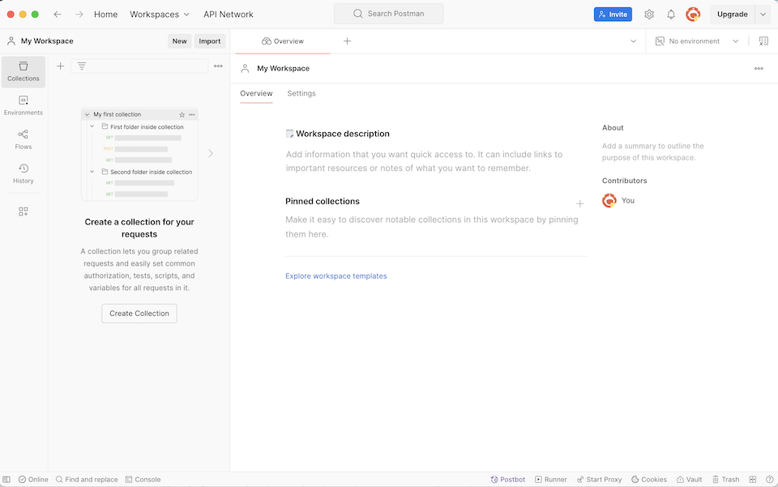

Now that we have our Postman account set up, let's move on to importing the necessary environment.

## Import Environment

The first step will be to download the environment file (the [*genesyscloud.postman_environment* file](https://developer-content.genesys.cloud/data/postman/genesyscloud.postman_environment) listed under [the *Additional Resources* section](/platform/api/postman).  
You can then import it in Postman, clicking on the *Import* button and browsing to the file.  
This will create a new *Environment* named **GenesysCloud v2**. It contains a list of the variables, used in the different Platform API endpoints. You can preset any of the variables' value in the Environment.

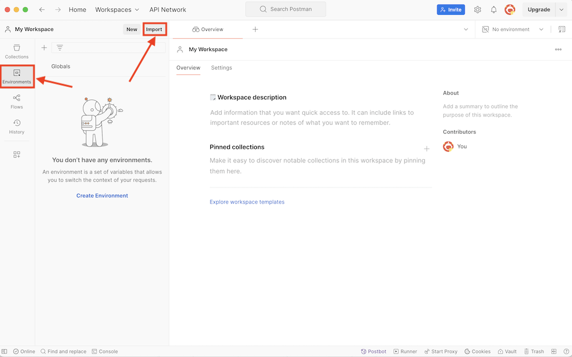

However, the only one that matters at this stage is `environment`. This will define the Genesys Cloud region to use for Platform API requests - e.g. `mypurecloud.com` for Americas (US East), `mypurecloud.ie` for EMEA(Dublin), ... You can find [the list of Genesys Cloud regions in the Resource Center](https://help.mypurecloud.com/?p=162751) and on the [Developer Center](/platform/api/).

I'll set the *environment* to `mypurecloud.ie` as my Genesys Cloud org is in the EMEA(Dublin) region. Then, I'll save the changes.

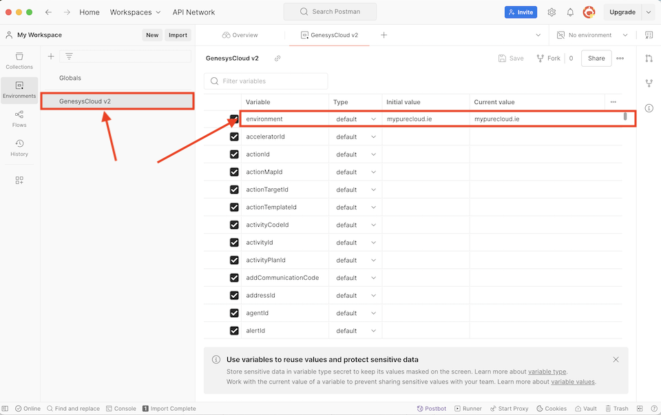

_**When you want to use a specific Postman Environment, don't forget to select it in Postman.**_

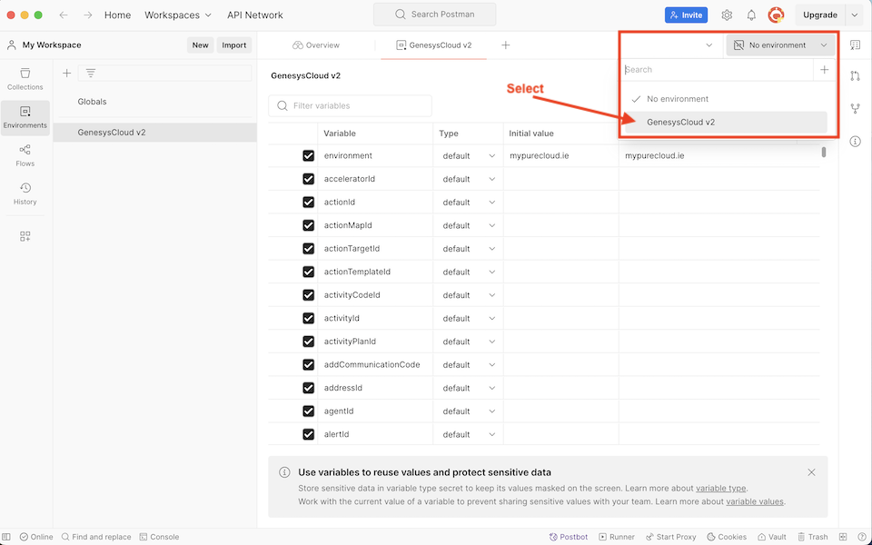

Now that the environment is set up, let’s move on to importing the API collection.

## Import API Collection

The second step will be to download the description of the Platform API endpoints, made available as a Postman collection.  
You can download the [*full collection* file](https://developer-content.genesys.cloud/data/postman/collections/full.json) listed under [the *Addtional Resources* section](/platform/api/postman) or an *API Group* depending on the requests you want to trigger.

Throughout this blog post, I am going to import the Platform API collection three times. It is of course not necessary to import it these many times. But I would like to show three possibilities for their Authorization's configuration:
- [OAuth Client Credentials Grant](/authorization/platform-auth/use-client-credentials): Used for server-to-server authentication (i.e. *server context*)
- [OAuth Implicit Grant](/authorization/platform-auth/use-implicit-grant): Requires user authentication through a browser (i.e. *user context*)
- [OAuth PKCE Grant](/authorization/platform-auth/use-pkce): Secure user authentication, through a browser, without a client secret (i.e. *user context*)

As I mentioned earlier in this blog, when it comes to authenticating as a user and sending Platform API requests, I prefer to use [our Developer Tools API Explorer](/devapps/api-explorer). The API Explorer will leverage the logged-in user's account and permissions (i.e. *user context*).

You can import the collection file in Postman, selecting *Collections*, clicking on the *Import* button and browsing to the file.  

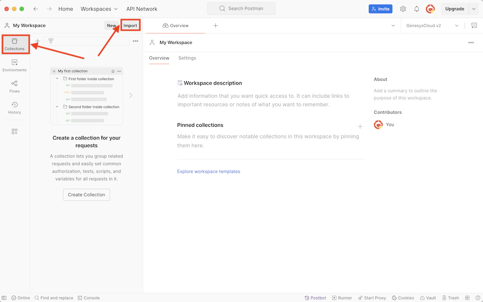

This will create a new *Collection* named **PureCloud Platform API**.

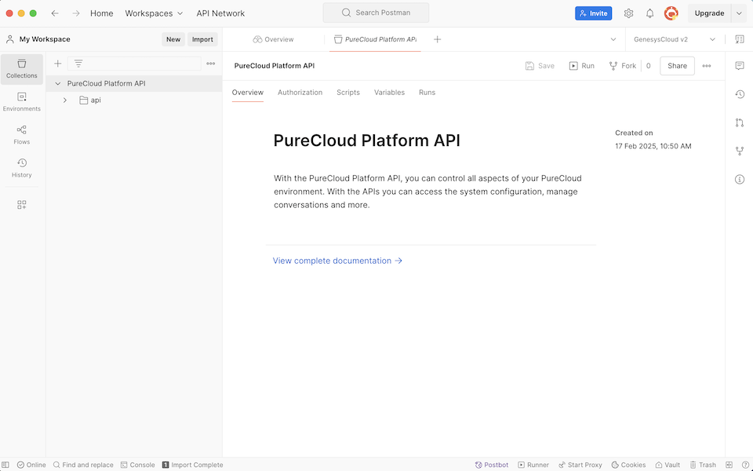

I will import the collection 3 times and rename them: *Platform API with Client Credentials Grant*, *Platform API with Implicit Grant* and *Platform API with PKCE Grant*.  
As I wrote just above, you will likely only need one type of Authorization - and import the collection once only. I am importing them several times to describe the different configuration for each of the OAuth Grant flows (Client Credentials, Implicit, PKCE).

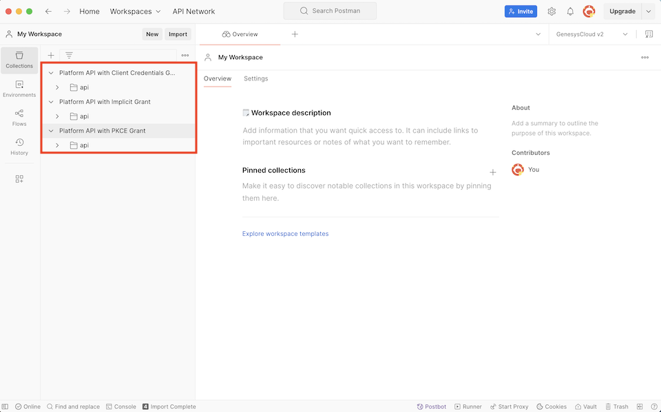

Having imported our API collection, we can now focus on configuring the authorization settings.

## Configure Authorization

Let's start by exploring the OAuth Client Credentials Grant method.

### Using OAuth Client Credentials Grant

You will need an OAuth Client with Grant Type set to `Client Credentials`.
You can [create a new OAuth Client](https://help.mypurecloud.com/?p=188023) or use one you have already configured.

#### Genesys Cloud Configuration

We will create a new OAuth Client, named *OAuth Client Credentials for Postman*.  
Select `Client Credentials` as *Grant Type*.

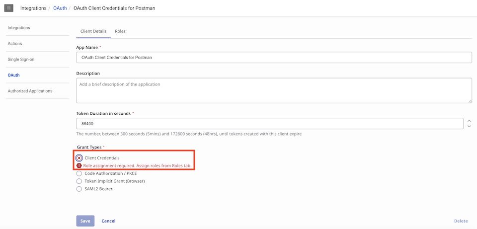

Make sure to enable the necessary roles/divisions in your OAuth Client configuration. This will drive what API Requests are authorized for this client and what visibility they have on division-base objects.

*In my Genesys Cloud organization, I have 2 divisions: Home and CustomDivision and I want my OAuth Client to have the necessary permissions to gather data from both.*

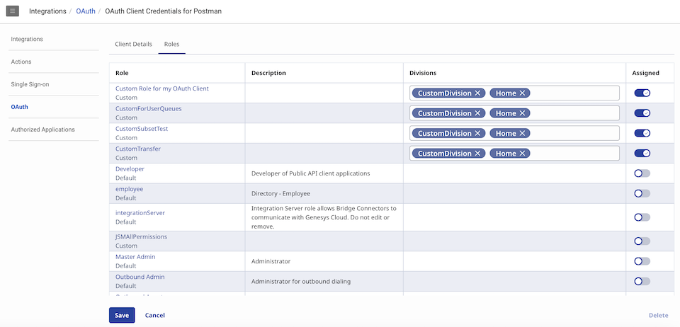

Click *Save* and _**note the Client ID and Client Secret**_. We will need them while configuring Postman.

#### Postman Configuration

Select *Collections*, click on the *Platform API with Client Credentials Grant* collection we just imported, and navigate to its *Authorization* tab.

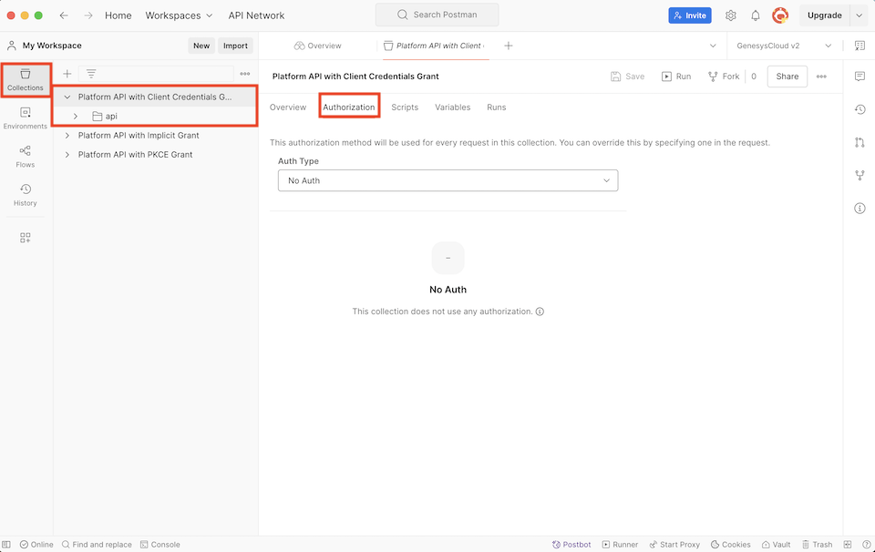

In the *Auth Type* drop-down list, select `OAuth 2.0`.  
In *Add auth data to*, keep/set `Request Headers`.

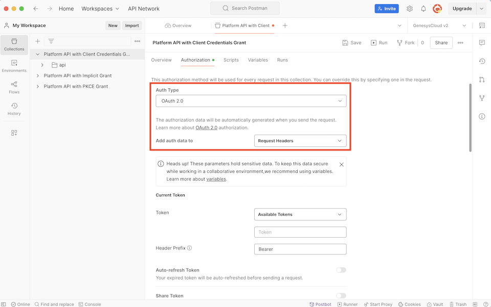

We'll define a *Token Name*: `GC Client Credentials Grant token`  
*This is not related to OAuth 2.0 but to Postman user interface. You can name it as you want.*

Set *Grant Type* to `Client Credentials`.

Set *Auth URL* to `https://login.{{environment}}/oauth/token`  
This will leverage the *environment* variable we have defined in our *GenesysCloud v2* Postman Environment (i.e. corresponding to the region of your Genesys Cloud org: mypurecloud.com, mypurecloud.ie, ...).

Set `Client ID` to the Client ID of the OAuth Client we have created in Genesys Cloud.

Set `Client Secret` to the Client Secret of the OAuth Client we have created in Genesys Cloud.

You can leave *Scope* unset.  
And you can keep/set *Client Authentication* to `Send as Basic Auth header`.

Save your changes to the Collection configuration.

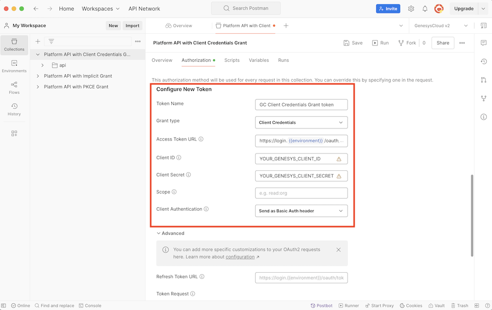

We are now ready to test the Authorization process.

Make sure you have selected the *GenesysCloud v2* Environment.  
And click on *Get New Access Token* button.

Once Postman receives the token, *Proceed* and *Use New Token*.

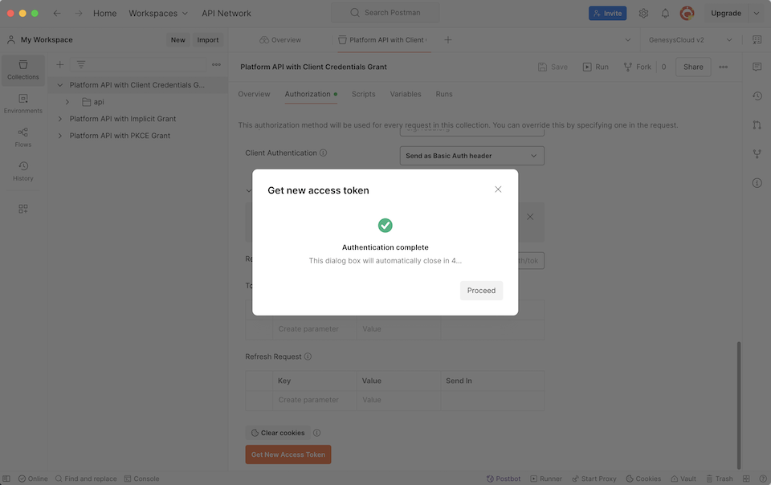

*Note: I have hidden my Access Token and my client_id and client_secret in the following screenshot.*

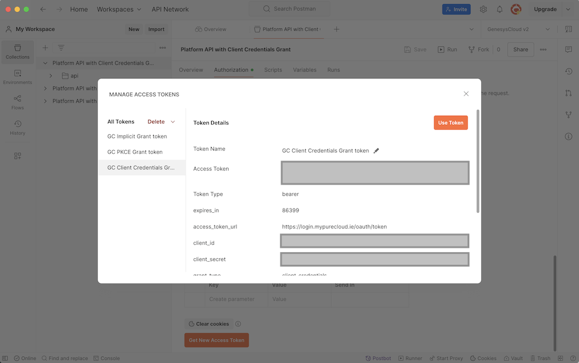

You are now ready to select an API endpoint in the Collection and *Send* a request.

#### Using Postman Vault

Collections and Environments are stored in your Postman account (cloud/web). Therefore, you may not want to store the OAuth Client Secret directly at Collection or at Environment levels. And you could do the same for the OAuth Client ID.

Postman has a [Vault capability](https://learning.postman.com/docs/sending-requests/postman-vault/postman-vault-secrets/) so that you can store secrets locally.

You can access the vault via its icon at the bottom of the Postman user interface.

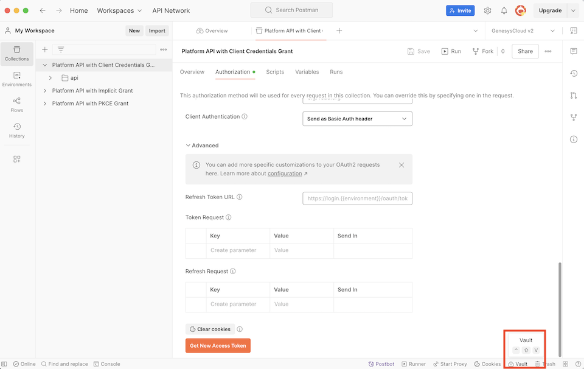

Create a new key/value to store the OAuth Client Secret. You can choose the keyname you want.

I have named mine `gc-client-credentials-secret` and I have stored my OAuth Client Secret as value.

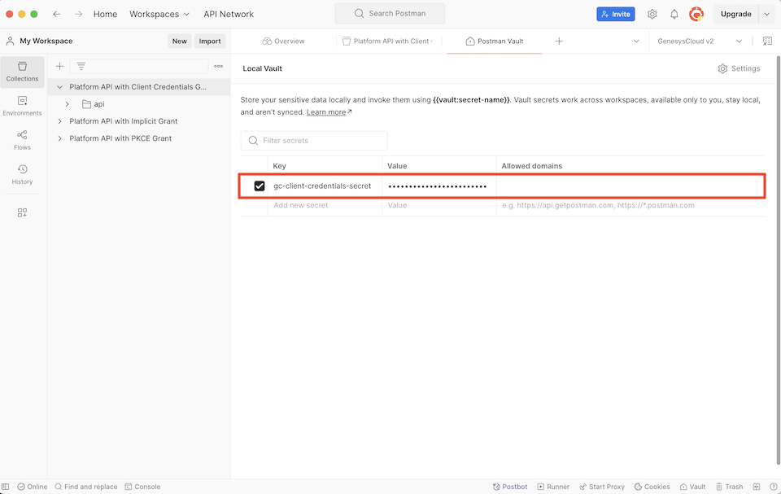

In the *Platform API with Client Credentials Grant* collection, in its *Authorization* tab, modify the Client Secret configuration.

Set *Client Secret* to `{{vault:gc-client-credentials-secret}}`.

Save.

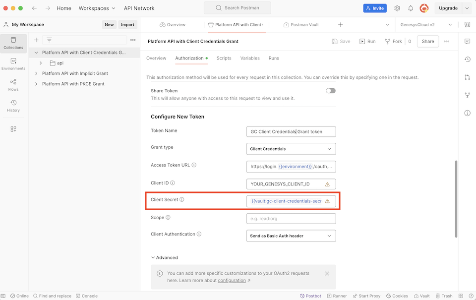

*Note that you can also store your OAuth Client IDs in the Postman Vault, and update the Client ID configuration in the different collections to reference the value from the vault.*

Next, we'll examine how to set up the OAuth Implicit Grant.

### Using OAuth Implicit Grant

You will need an OAuth Client with Grant Type set to `Token Implicit Grant`.
You can [create a new OAuth Client](https://help.mypurecloud.com/?p=188023) or use one you have already configured.

#### Genesys Cloud Configuration

We will create a new OAuth Client, named *OAuth Implicit for Postman*.  
Select `Token Implicit Grant` as *Grant Type*.

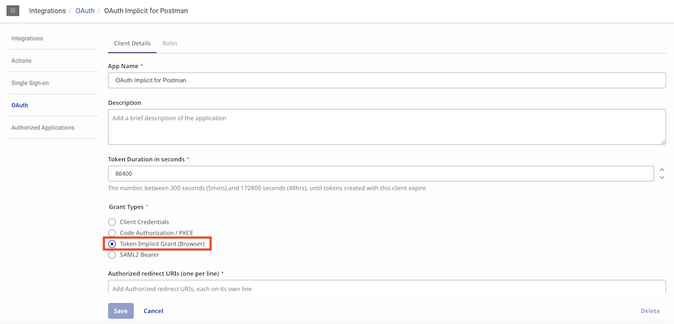

When Postman is configured to *Authorize using browser* (see in next section), it currently uses `https://oauth.pstmn.io/v1/callback` as Redirect Url. Add this url in *Authorized Redirect Uris* in your OAuth Client configuration.  
If Postman changes the URL in the future, update it in your Genesys Cloud OAuth Client's configuration accordingly.

Make sure to enable the necessary [scopes in your OAuth Client configuration](https://help.mypurecloud.com/?p=189203). This will drive what API Requests are authorized for this client (scopes act as a filter with the user's permissions).

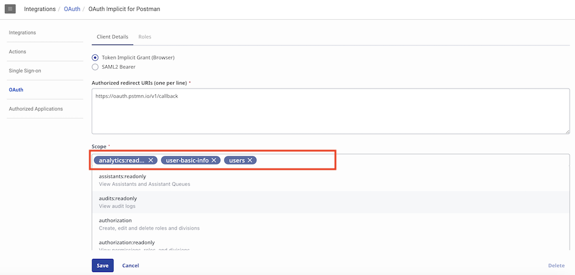

Click *Save* and _**note the Client ID**_ (Client Secret is not needed in an OAuth Implicit Grant flow). We will need them while configuring Postman. 

#### Postman Configuration

Select *Collections*, click on the *Platform API with Implicit Grant* collection we just imported, and navigate to its *Authorization* tab.

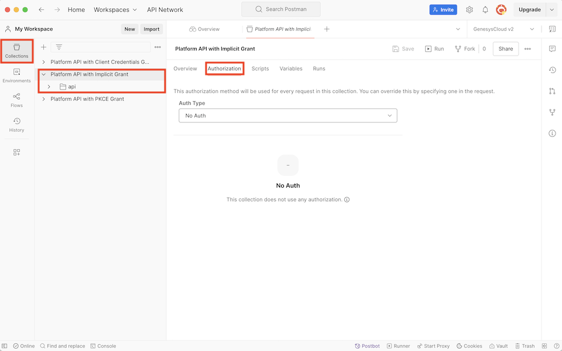

In the *Auth Type* drop-down list, select `OAuth 2.0`.  
In *Add auth data to*, keep/set `Request Headers`.

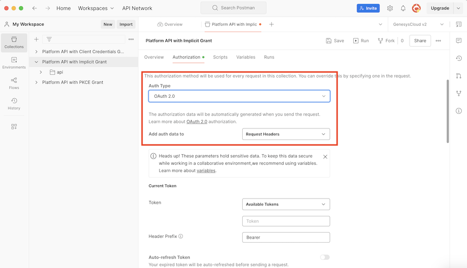

We'll define a *Token Name*: `GC Implicit Grant token`  
*This is not related to OAuth 2.0 but to Postman user interface. You can name it as you want.*

Set *Grant Type* to `Implicit`.

Enable the *Authorize using browser* checkbox. This will set the Callback URL used by postman to `https://oauth.pstmn.io/v1/callback`.

Set *Auth URL* to `https://login.{{environment}}/oauth/authorize`  
This will leverage the *environment* variable we have defined in our *GenesysCloud v2* Postman Environment (i.e. corresponding to the region of your Genesys Cloud org: mypurecloud.com, mypurecloud.ie, ...).

Set `Client ID` to the Client ID of the OAuth Client we have created in Genesys Cloud.

You can leave *Scope* and *State* unset.  
And you can keep/set *Client Authentication* to `Send as Basic Auth header`.

Save your changes to the Collection configuration.

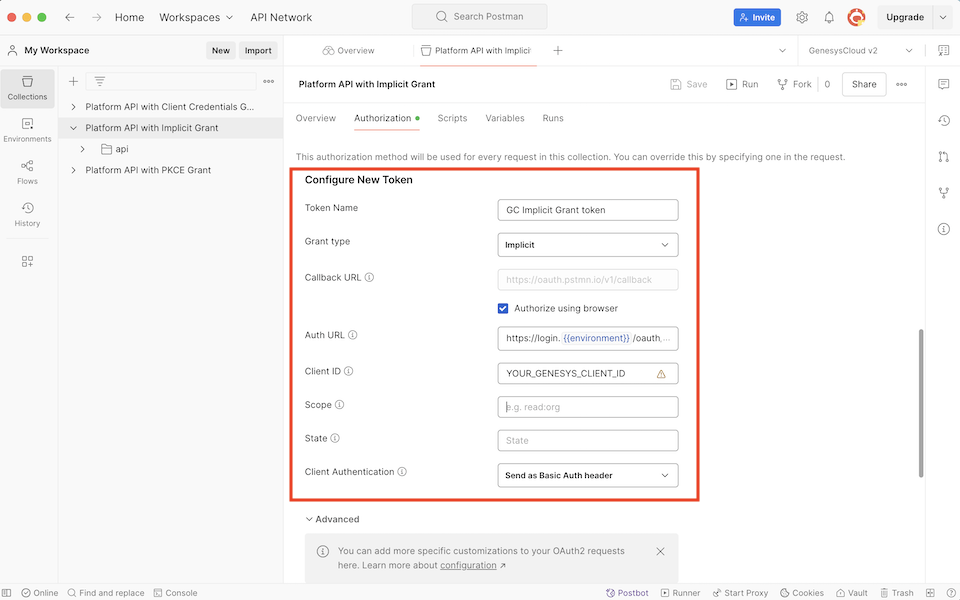

We are now ready to test the Authorization process.

Make sure you have selected the *GenesysCloud v2* Environment.  
And click on *Get New Access Token* button.

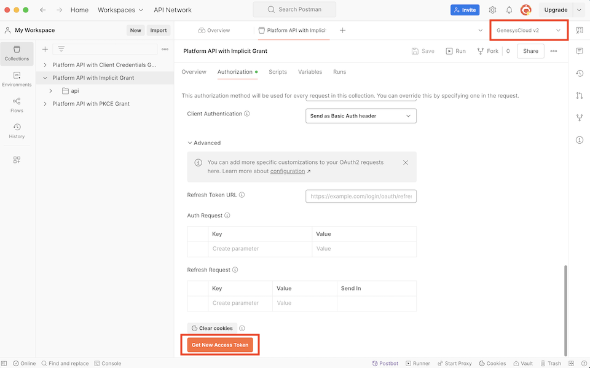

Postman will open a new browser tab to allow you to authenticate with Genesys Cloud.  
On success, Postman will display a page like the following and will request/attempt to open Postman to pass the collected token. Access and open Postman.

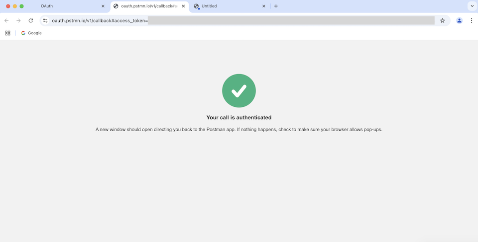

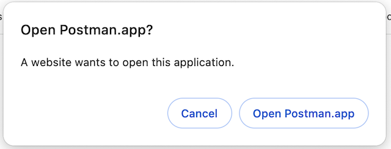

Once Postman receives the token, *Proceed* and *Use New Token*.

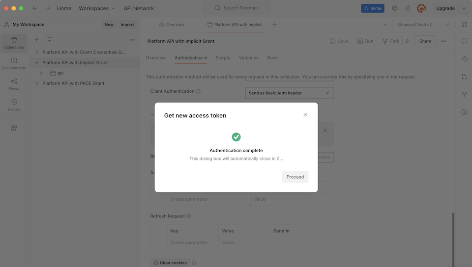

*Note: I have hidden my Access Token and my client_id in the following screenshot.*

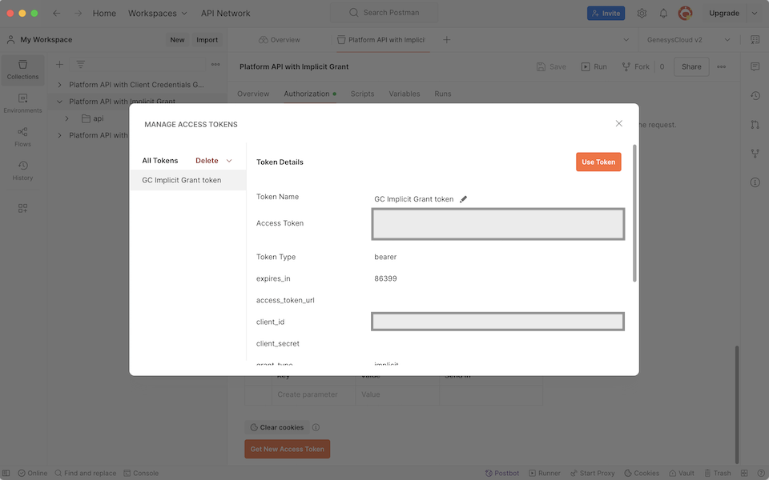

You are now ready to select an API endpoint in the Collection and *Send* a request.

Finally, let's look at configuring the OAuth PKCE Grant.

### Using OAuth PKCE Grant

You will need an OAuth Client with Grant Type set to `Code Authorization/PKCE`.
You can [create a new OAuth Client](https://help.mypurecloud.com/?p=188023) or use one you have already configured.

#### Genesys Cloud Configuration

We will create a new OAuth Client, named *OAuth PKCE for Postman*.  
Select `Code Authorization/PKCE` as *Grant Type*.

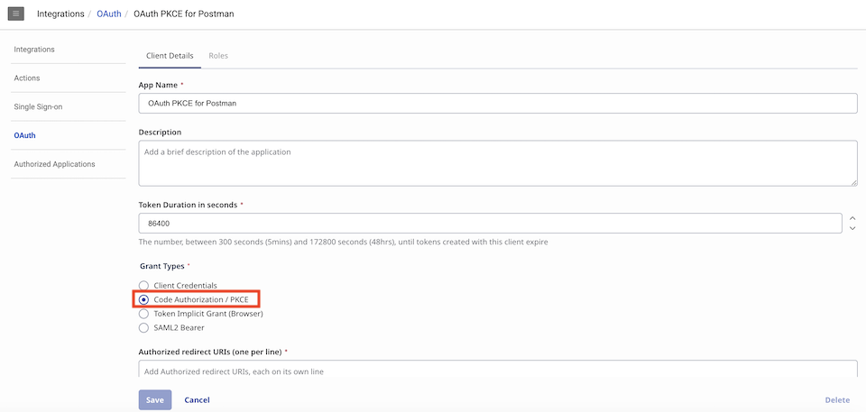

When Postman is configured to *Authorize using browser* (see in next section), it currently uses `https://oauth.pstmn.io/v1/callback` as Redirect Url. Add this url in *Authorized Redirect Uris* in your OAuth Client configuration.  
If Postman changes the URL in the future, update it in your Genesys Cloud OAuth Client's configuration accordingly.

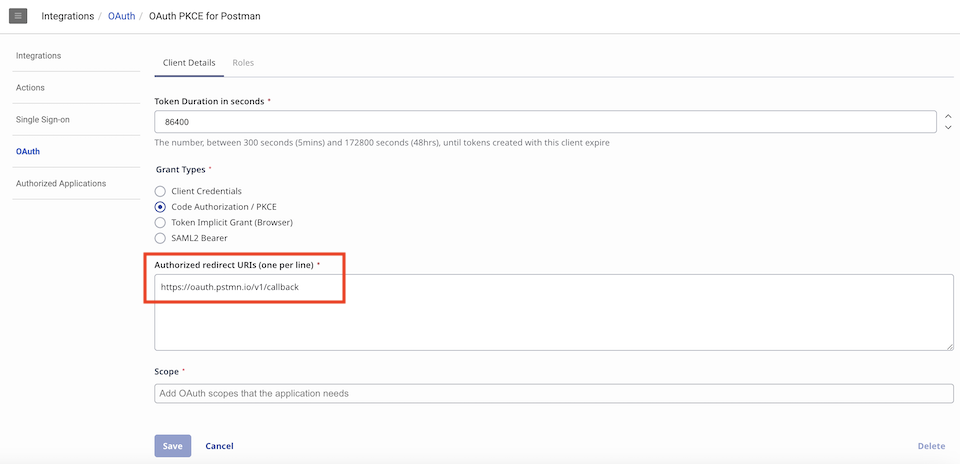

Make sure to enable the necessary [scopes in your OAuth Client configuration](https://help.mypurecloud.com/?p=189203). This will drive what API Requests are authorized for this client (scopes act as a filter with the user's permissions).

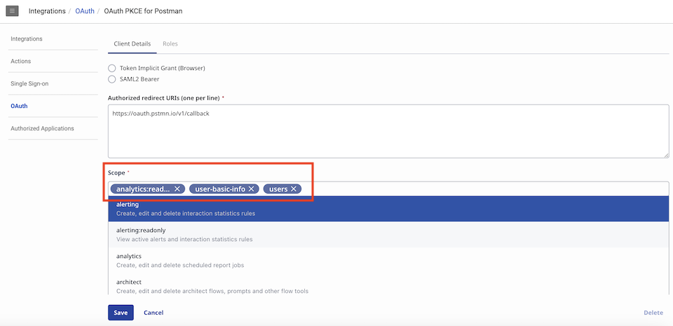

Click *Save* and _**note the Client ID**_ (Client Secret is not needed in an OAuth PKCE Grant flow). We will need them while configuring Postman.

#### Postman Configuration

Select *Collections*, click on the *Platform API with PKCE Grant* collection we just imported, and navigate to its *Authorization* tab.

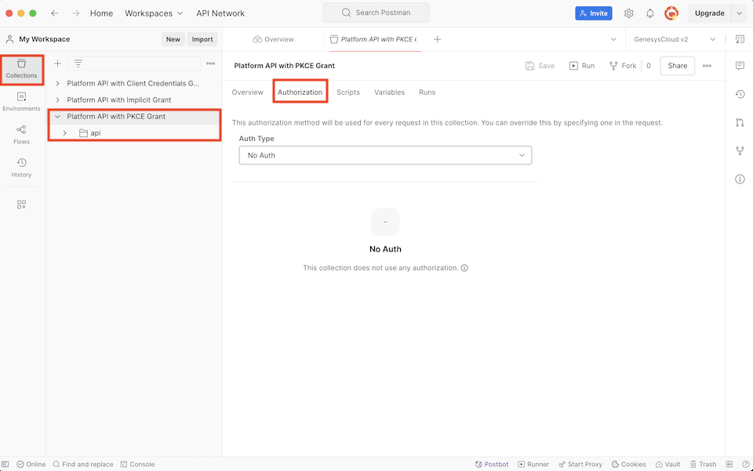

In the *Auth Type* drop-down list, select `OAuth 2.0`.  
In *Add auth data to*, keep/set `Request Headers`.

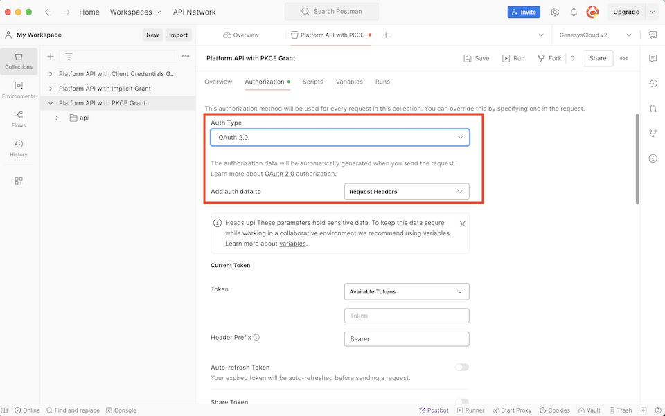

We'll define a *Token Name*: `GC PKCE Grant token`  
*This is not related to OAuth 2.0 but to Postman user interface. You can name it as you want.*

Set *Grant Type* to `Authorization Code (With PKCE)`.

Enable the *Authorize using browser* checkbox. This will set the Callback URL used by postman to `https://oauth.pstmn.io/v1/callback`.

Set *Auth URL* to `https://login.{{environment}}/oauth/authorize`  
This will leverage the *environment* variable we have defined in our *GenesysCloud v2* Postman Environment (i.e. corresponding to the region of your Genesys Cloud org: mypurecloud.com, mypurecloud.ie, ...).

Set *Access Token  URL* to `https://login.{{environment}}/oauth/token`  
This will also leverage the *environment* variable we have defined in our *GenesysCloud v2* Postman Environment.

Set `Client ID` to the Client ID of the OAuth Client we have created in Genesys Cloud.

**You do not need to set Client Secret in an OAuth PKCE Grant flow.**

Set/Keep *Code Challenge Method* to `SHA-256`

You can leave *Scope* and *State* unset.  
And you can keep/set *Client Authentication* to `Send as Basic Auth header`.

Save your changes to the Collection configuration.

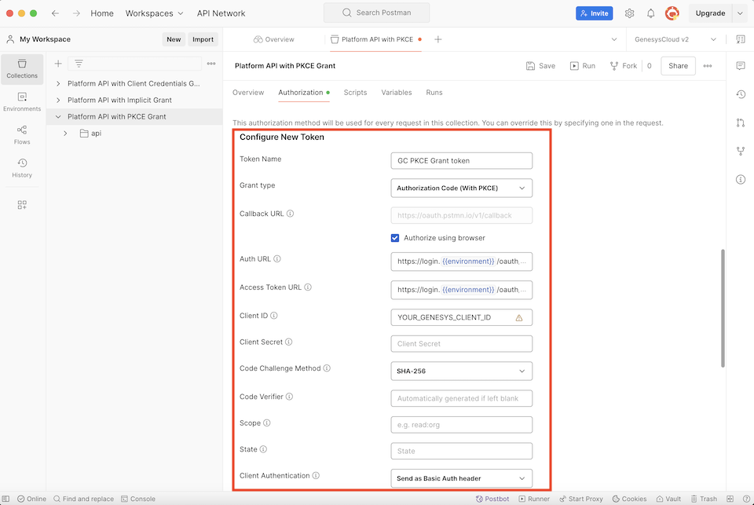

We are now ready to test the Authorization process.

Make sure you have selected the *GenesysCloud v2* Environment.  
And click on *Get New Access Token* button.

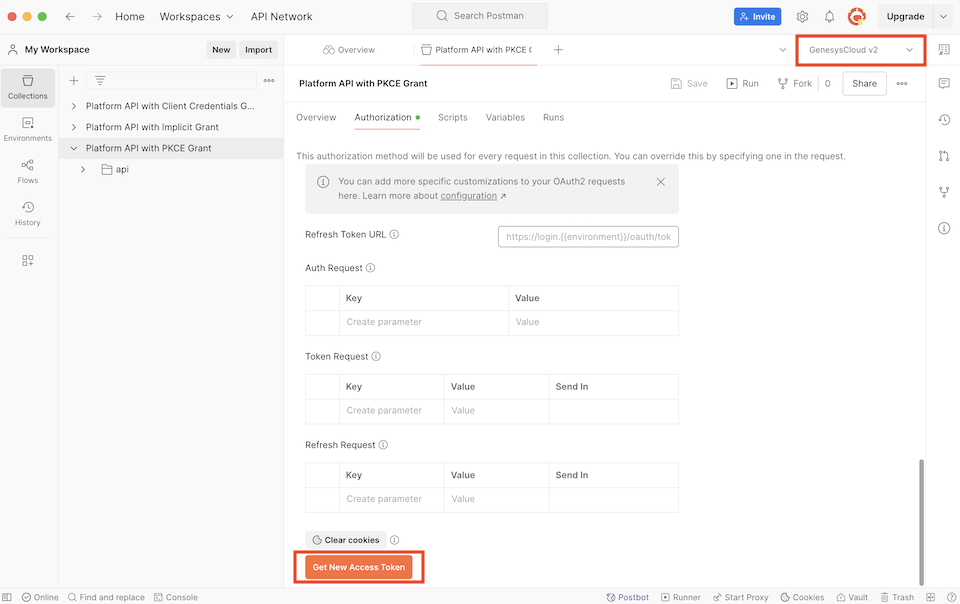

Postman will open a new browser tab to allow you to authenticate with Genesys Cloud.  
On success, Postman will display a page like the following and will request/attempt to open Postman to pass the collected token. Access and open Postman.

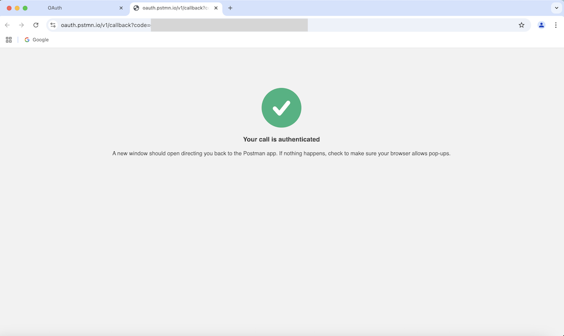

Once Postman receives the token, *Proceed* and *Use New Token*.

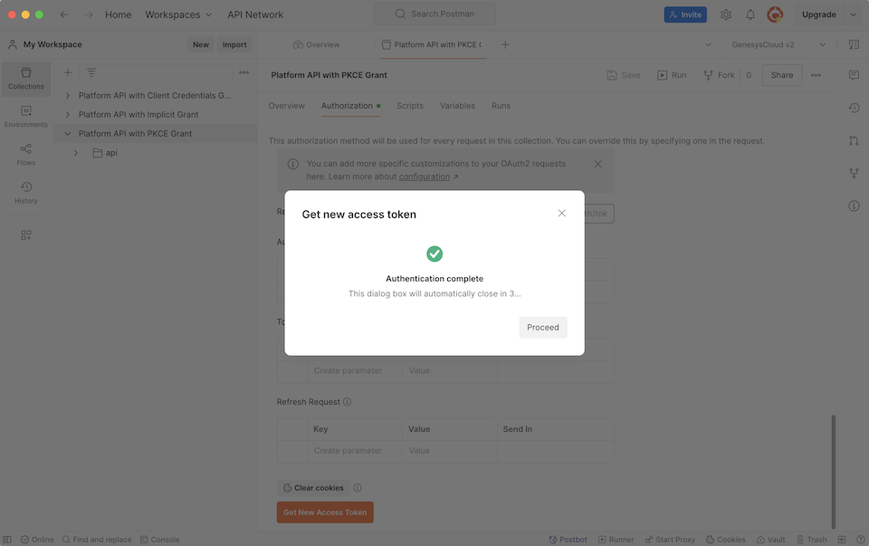

*Note: I have hidden my Access Token and my client_id in the following screenshot.*

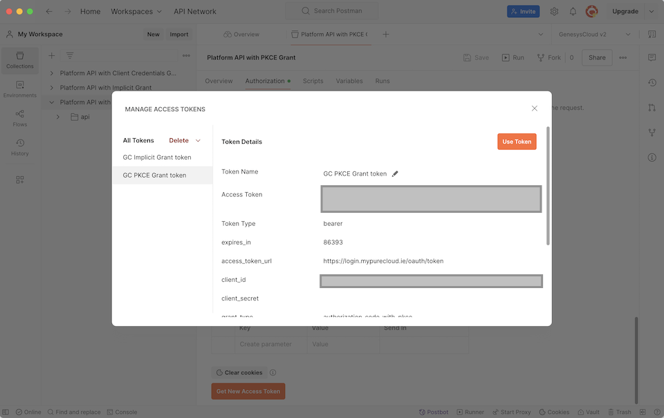

You are now ready to select an API endpoint in the Collection and *Send* a request.

Now that we've covered the various authorization methods, let's wrap up with some final thoughts.

## Closing thoughts

You should now be ready to use Postman to send Platform API requests to Genesys Cloud using any of the Authorization Grant flows covered in this blog (Client Credentials, Implicit, PKCE).

Have fun!!!

## Additional resources and references

To help you further, here are some valuable resources and references:
1. [API Explorer](/devapps/api-explorer-standalone)
2. [Genesys Cloud SDK](/devapps/sdk/)
3. [Genesys Cloud Platform API](/platform/api/)
4. [Authorization - Client Credentials Grant](/authorization/platform-auth/use-client-credentials)
5. [Authorization - Implicit Grant](/authorization/platform-auth/use-implicit-grant)
6. [Authorization - PKCE Grant](/authorization/platform-auth/use-pkce)
